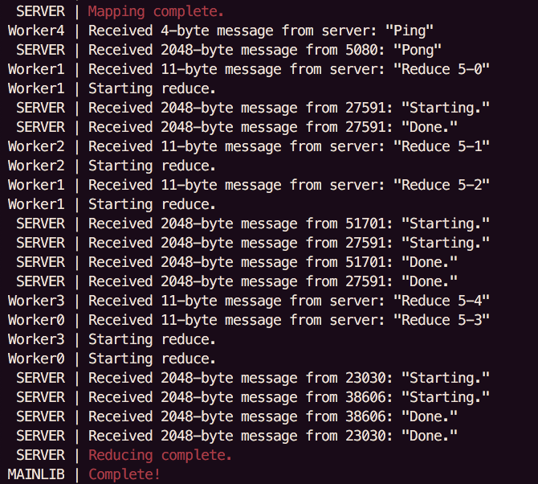

<!-- <p align="center"> -->
<!--    -->
<!--   <h1>MapReduce</h1> -->
<!-- </p> -->

<!--  -->

# MapReduce

## Motivation/About

With the rise of multi-core CPUs and companies like ARM producing low cost processing power, distributed algorithms that can utilize parallelization to its fullest extent are more valuable than ever. Google's MapReduce provides a framework for the distribution of algorithms, handling distribution and logistics of parallelization for the user and only requiring the input of two user defined functions: `map` and `reduce`  (inspired by functional programming languages like Lisp). 

The `map` function takes a key value pair and produces a set of intermediate key value pairs, i.e. <document, contents> to a list of <letter, count> with different letters.

The `reduce` function merges a set of key value pairs (with the same key) and returns a singular combined key value pair, i.e. list of <letter, count> to just one <letter, total>.

The commmutative nature of these functions allows easy parallelization, as many `map` functions can take a subset of the document and combining their results will yield the same answer. Many `reduce` functions can be run on a subset of the total intermediate pairs and combining their results will also yield the same answer. This means that if the input file is split, the work of mapping and reducing can be assigned to many different processors at once, significantly decreasing computing time.

## Examples/Testing

### Examples
The only current example is a program to find the number of occurences of each letter of the alphabet in a text document.

### Demo Usage
*Note! As of now, number of workers must be a factor of linecount!*
Run the executable with four arguments—in order they are the number of map workers, path of the file to be processed, your public IP, and the number of reduce workers (which shouldn't be greater than the number of map workers).

To run the demo on a cluster (only supported in the `cluster-support` branch as of yet and largely unstable) run the program as normal on each device (in the future you will be able pass the optional '--noserver' argument to prevent multiple servers).

### Releases
To simply run a built executable of the MapReduce demo, go to the Releases tab and download the release for your OS (Windows is as of yet not supported). Run the executable from the command line with `./example NUM-WORKERS PATH-TO-INPUT YOUR-PUBLIC-IP`.

### Building from Source
First, clone the repository with 
```
git clone https://github.com/richardfeynmanrocks/mapreduce.git
```

For MacOS, run the following commands inside the project directory:
```
gcc example.c mapreduce.c worker.c server.c -g -w -o example
./example NUM-MAP-WORKERS PATH-TO-INPUT YOUR-PUBLIC-IP NUM-REDUCE-WORKERS
```
To build on Linux, run the following commands in the project directory:
```
gcc example.c mapreduce.c worker.c server.c -pthread -lm -w -o example
./example NUM-MAP-WORKERS PATH-TO-INPUT YOUR-PUBLIC-IP NUM-REDUCE-WORKERS
```

## Using as a Library
There are three steps (not in order, all three need to be done for anything to work) to using this as a library: compiling it into an archive file and linking it to your code, including the header file in your code, and writing proper functions to be passed into it. 

### Compilation
Compile the project into a library by producing the required object files then creating an archive file. To do this, run the following commands in the project directory:
```
gcc mapreduce.c worker.c server.c -O -c -g
ar rcs mapreduce.a mapreduce.o server.o worker.o
```
Once you've done that, when compiling your project link it with the mapreduce.a file (copy it into *your* project's directory). Example:
```
gcc your-file.c some-other-file-in-your-proj.c mapreduce.a -o executable
```

### Inclusion

#### C
To include this in your code either manually include the specific header file 
```c
#include "PATH-TO-MAPREDUCE.H"
```
or copy the header file into `/usr/local/include` and include it in your code with
```c
#include <mapreduce.h>
```
#### C++
If you need to include this from C++ you'll need to do the same as above but wrap it in an `extern` statement. For example:
```c++
extern "C" {
  #include "PATH-TO-MAPREDUCE.H"
}
```

### How to Write The Functions

#### Map

- Must take `pair` and return a `pair` array.
- You are responsible for allocating the memory for the arrays, but not freeing it.
- You are responsible for allocating the values (that are going in the arrays), but not freeing it.
- It is highly advised you null-terminate your arrays by setting the key and value pointers of the last pair to 0x0;
- Looking at the example will likely help.

#### Reduce

- Must take `pair` array and return an `pair` array.
- You are responsible for allocating the memory for the output array, but not freeing it.
- You are responsible for allocating the values (that are going in the array), but not freeing it.
- You're going to need to cast the pointers in the input array (and dereference them as well I suppose).
- It is highly advised you null-terminate your array once again by setting the key and value pointers of the last pair to 0x0;
- Looking at the example will likely help.

#### Translate

- Must return void and take char array that is the path specifier.
- Simply cast the pointers to the right type, dereference them, and write to a file. 
- Example may help.

## Known Issues
Navigate to the 'Projects' tab at the top of this github repository, [linked here](https://github.com/richardfeynmanrocks/mapreduce/projects/1), to see a little board of errors and planned improvements that updates more frequently than the README (and has the added benefit of not adding junk to the commit log).

## Execution Overview
Note: Although similar in some respects, this does not describe the Google implementation's execution but this implementation's execution.

1. User calls MapReduce code with the `begin` function, specifying path to input file, number of map workers, # of reduce workers, IP, a `translate` function, and the `map` and `reduce` functions.
2. `begin` function calls `split` which splits input file into NUM-MAP-WORKERS pieces for mapping.
3. `begin` function creates a thread for server with `start_server` and NUM-WORKERS threads for workers using `start_worker`, then waits for server to finish.
4. `start_server` launches a UDP server and waits for workers to reveal themselves as well as sets up an array for tracking worker statuses.
5. `start_worker` opens a socket to communicate with server and declares its existence.
6. The server then orders each of the workers to perform a different `map` task by passing a generalized `pair` structure with the corresponding file path as its key. Server then awaits reports of worker completion. 
  - Sidenote: The `pair` structure, in order to allow more extensible use of the implementation, is solely two void pointers. The user-side `map`, `reduce`, and `translate` functions will need to dereference this themselves. The ramifications of such a design are that the implementation is entirely unaware of what is being passed through it (only knowing the address of the key/value in memory), meaning any type can be passed into the implementation, even objects from C++ (although this is as of now untested).
7. Worker processes call `map` function which opens the file part, does something, then writes the addresses of the output into an array of key value pairs. Workers then write output to intermediate file and report to server as done.
8. Once all map tasks are completed, server begins ordering worker processes to perform `reduce` tasks. 
9. Worker processes then read all intermediate files and aggregate them into one large file, sort the file, then run reduce on a subset of those key value pairs while ensuring that pairs of a specific key are not split up (i.e all <A, number> pairs must be processed by one worker). Reduce function creates pointers to the addresses specified by the intermediate files, dereferences said pointers, does something to 'reduce' the data, then writes addresses of reduced values into another array of key value pairs and writes its addresses (as the `pair` structure is just two pointers) to another file. 
11. Server orders a process to clean up.
12. Worker 0 calls the user-defined `translate` function to translate the result into something fit for human consumption. `translate` function mainly creates pointers to right addressses in memory, derefences pointers, does something, then writes readable output to file. 
13. Worker 0 calls the `clean` function which goes through each item in `map` output array and `reduce` output array and frees the memory allocated for the keys/values.
10. Once server hears that all processes are completed and cleanup is done, the `start_server` function exits successfully.
11. `begin` function kills all threads.
12. Program exits back into user code.

## Future Features
- [ ] Error handling and testing
- [ ] Cross-machine computation
- [ ] Refinements detailed in paper
- [ ] Fault tolerance
- [ ] Backup tasks
- [ ] Benchmarking
- [ ] Reporting via website
- [ ] Package manager support
